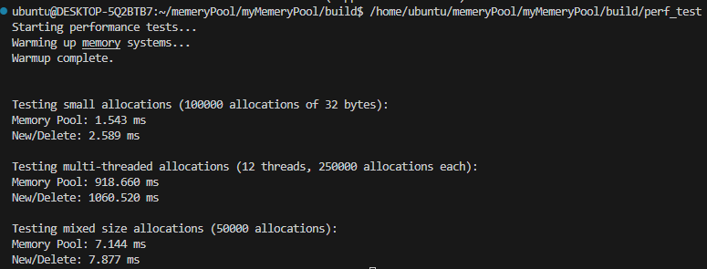
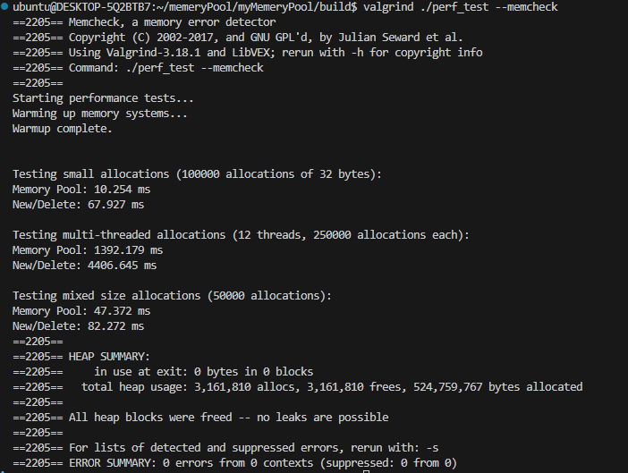

### TinyMemoryPool
该项目包括以下主要功能：
- 线程本地缓存（ThreadCache）：每个线程维护自己的内存块链表，减少线程间的锁竞争，提高内存分配效率。
- 中心缓存（CentralCache）：用于管理多个线程共享的内存块，支持批量分配和回收，优化内存利用率。
- 页面缓存（PageCache）：负责从操作系统申请和释放大块内存，支持内存块的合并和分割，减少内存碎片。
- 自旋锁和原子操作：在多线程环境下使用自旋锁和原子操作，确保线程安全的同时减少锁的开销。

项目架构图如下：      
```
+----------------+       +----------------+       +----------------+
|  ThreadCache   |       |  ThreadCache   |       |  ThreadCache   |
|  线程本地缓存   |       |  线程本地缓存   |       |  线程本地缓存   |
| 无锁加速分配    |       | 无锁加速分配    |       | 无锁加速分配    |
| 减少竞争       |       | 减少竞争       |       | 减少竞争       |
+-------+--------+       +-------+--------+       +--------+-------+
        |                        |                         |
        |                        |                         |
        +-----------+------------+-------------------------+
                    |
                    v
          +---------+---------+
          |   CentralCache    |
          |  共享内存管理     |
          |  批量获取和分配    |
          |  自旋锁保护      |
          +---------+---------+
                    |
                    v
          +---------+---------+
          |     PageCache     |
          |  大块内存管理     |
          |  从操作系统获取   |
          |  切分成小块      |
          +---------+---------+
                    |
                    v
          +---------+---------+
          |      操作系统     |
          +-------------------+

```
## 编译  
```
mkdir build
cd build
```
执行 cmake 命令
```
cmake ..
```
执行 make 命令
```
make
``` 
## 运行
```
./可执行文件名
```
## 测试结果
### 分配时间

### 内存泄漏检测



性能优化 perf 生成火焰图检测

- 1. 优化桶数量
- 2. 优化pagecathe 使用基数树(类似虚拟页表) 查找span
- 3. 封装
